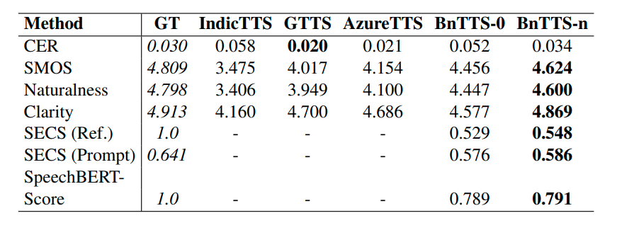
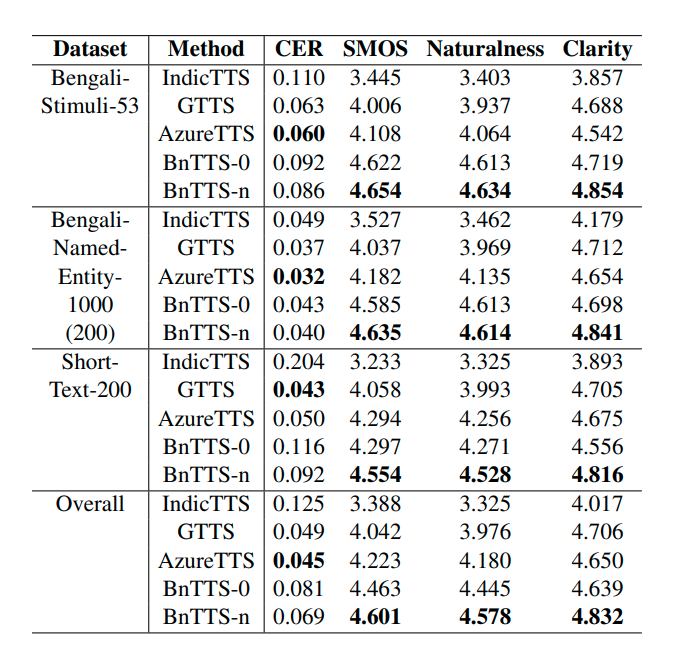
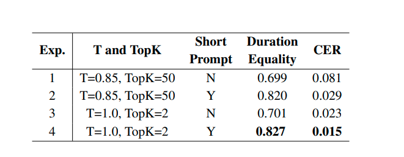

# BnTTS(Bangla Text To Speech)

### Abstract:
This paper introduces BnTTS (Bangla Text-ToSpeech), the first framework for Bangla speaker adaptation-based TTS, designed to bridge the gap in Bangla speech synthesis using minimal training data. Building upon the XTTS architecture, our approach integrates Bangla into a multilingual TTS pipeline, with modifications to account for the phonetic and linguistic characteristics of the language. We pretrain BnTTS on 3.85k hours of Bangla speech dataset with corresponding text labels and evaluate performance in both zero-shot and few-shot settings on our proposed test dataset. Empirical evaluations in few-shot settings show that BnTTS significantly improves the naturalness, intelligibility, and speaker fidelity of synthesized Bangla speech. Compared to state-of-the-art Bangla TTS systems, BnTTS exhibits superior performance in Subjective Mean Opinion Score (SMOS), Naturalness, and Clarity metrics.

__Paper:__ 

[BnTTS: Few-Shot Speaker Adaptation in Low-Resource Setting](https://arxiv.org/pdf/2502.05729)


# Evaluation Dataset

| Dataset                   | Source/Description                            | Evaluation Focus                                                     |
|---------------------------|-----------------------------------------------|----------------------------------------------------------------------|
| **BnStudioEval**          | Derived from In-House HQ Data                 | High-fidelity speech generation and speaker adaptation               |
| **BnTTSTextEval**         | Text-only dataset (BnTTSTextEval.xlsx)        | Comprehensive text evaluation across multiple subsets                 |
| &nbsp;&nbsp;• BengaliStimuli53      | Subset of BnTTSTextEval                        | Assess phonetic diversity                                            |
| &nbsp;&nbsp;• BengaliNamedEntity1000| Subset of BnTTSTextEval                        | Evaluate named entity pronunciation                                  |
| &nbsp;&nbsp;• ShortText200           | Subset of BnTTSTextEval                        | Measure conversational fluency in short sentences, including fillers |


For evaluation, we propose two datasets: (1) BnStudioEval, derived from our In-House HQ Data, to assess high-fidelity speech generation and speaker adaptation, and (2) BnTTSTextEval (BnTTS Evaluation Data - BnTTSTextEval.xlsx) , a text-only dataset consisting of three subsets: BengaliStimuli53 (assessing phonetic diversity), BengaliNamedEntity1000 (evaluating named entity pronunciation), and (3) ShortText200 (measuring conversational fluency in short sentences, filler words, and common phrases used in everyday dialogue)

Dataset [Link](https://github.com/hishab-nlp/BnTTS/tree/main/eval_data)


# Evaluation



Table 1: Comparative average performance for reference-aware BnStudioEval dataset. SECS and SpeechBERTScore are not reported for IndicTTS, GTTS, and AzureTTS as these systems do not support speaker adaption.



Table 2: Comparative average performance analysis on the reference-independent BnTTSTextEval dataset.



Table 3: Impact of prompt duration, temperature (T), and Top-K on BnTTS-n performance in the ShortBnStudioEval Dataset.


## Models

Pretrain weight link: Up-comming


```Contributor
@misc{BnTTS,
  title={BnTTS: Few-Shot Speaker Adaptation in Low-Resource Setting},
  author={},
  howpublished={},
  year={2024}
}
```


